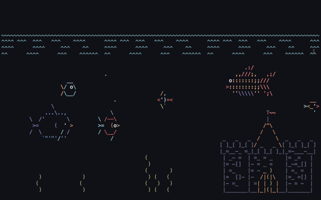

---
redirect_from:
  - "/01-bash/00-why-bash"
title: 'The Bash Shell'
prev_page:
  url: https://github.com/cjtu/spirl
  title: 'GitHub repository <i class="fa fa-external-link" aria-hidden="true"></i>'
next_page:
  url: /01_bash/01/00_shell.html
  title: 'Introduction'
comment: "***PROGRAMMATICALLY GENERATED, DO NOT EDIT. SEE ORIGINAL FILES IN /content***"
---
# Why Bash?

The shell is a tool that can be intimidating for first time users, but is common in scientific programming workflows. This chapter will cover the basics of shell navigation, file editing and bash scripting to reduce any shell anxiety you may have!

## Talking to your computer at a low level

If you mainly use a Mac or PC, you might get a tightness in your chest when you see something like this:

Even though Windows and OS X give us pretty things to click on, sometimes the plain old shell and your keyboard can be your best friend.

## But I like clicking things!

Reasons to use the shell anyways:

1.  Chances are, some program or script you encounter in your scientific programming endeavors will need to be installed or run from the shell.

2. Working in the shell makes things like moving or editing a lot of files - or backing them up with [version control](../02_git/why-git) - much easier.

3. Using the shell makes you look like a total hacker!

4. You can do [this](https://robobunny.com/projects/asciiquarium/html/) for some reason:

Let's get started with some basics.
