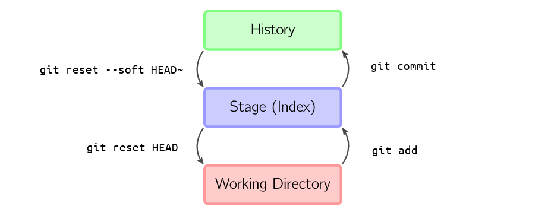

---
redirect_from:
  - "/02-git/01/02-git-basics"
title: 'Git basics'
prev_page:
  url: /02_git/01/01_git-overview.html
  title: 'Git overview'
next_page:
  url: /02_git/03/00_remotes-github.html
  title: 'Remotes and GitHub'
comment: "***PROGRAMMATICALLY GENERATED, DO NOT EDIT. SEE ORIGINAL FILES IN /content***"
---
# Git basics

Now let's learn to start version controlling some files Git!

## Checking if Git is installed

First thing's first, you will need access to a bash shell or mac Terminal (see [Chapter 1](../../01_bash/why-bash)) and to check if Git is installed. Open a shell and type `git --version`.

```bash
git --version
#git version 2.17.1
```

If there is a version number, great! Skip to [Configuring your Git](#configuring-your-git).

If there is no version number, you will need to install Git (this requires administrator access).

In bash, you can run:

```bash
sudo apt-get install git
```

For other Linux distributions, find guidance [here](https://git-scm.com/download/linux).

For Mac, the `git --version` command should have prompted you to install it.

For Windows, you should have access to a bash shell after following the instructions [here](../../01_bash/1_shell/windows), and should be able to use the command above to install Git.

### Configuring Git

The first thing to do when using git on a new machine is to let Git know who you are so that you get credit for your commits. To do this, we'll use the `git config --global` command (`--global` configures all of your repos, while `--local` configures a single repo only).

*Note*: For your email, use the same one that you used to make your GitHub account (if you have one), or the one you plan to use for GitHub.

```bash
git config --global user.name "<FirstName FamilyName>"
git config --global user.email "<your.email@somewhere.com>"
```

## Git on with it

Ok now let's practice some basic Git command to build on the foundations we learned in the [previous section](../git-basics).

### Making a local repository from scratch

In your shell, create a new directory called `myfirstrepo` and change directories to enter it.

```bash
mkdir myfirstrepo
cd myfirstrepo
```

Let's make `myfirstrepo/` a Git repository using `git init`.

*Note*: I will use the comment (`#`) symbol to show you what the output looked like on my computer so that you can follow along. The exact paths and wording may be slightly different on your machine.

```bash
git init
# Initialized empty Git repository in ~/projects/myfirstrepo/.git/
```

You can check that the `.git` folder was created with `ls`.

```bash
ls
# 
```

Oops, since it starts with a `.`, the `.git` folder is hidden, so we need to use the `--all` or `-a` flag for `ls`.

```bash
ls -a
# .  ..  .git
```

Great! That's all there is to it. Git will now track all changes we make to files in `myfirstrepo/`.

### Making our first commit

Let's make a new file and see if Git notices. Let's use our the bash redirection trick to make a new file with some text in it.

```bash
echo 'Hello World!' > file1.txt
```

Since Git is tracking `myfirstrepo`, it should have noticed the change. You can always check what Git is seeing with `git status`.

```bash
git status
# On branch master

# No commits yet

# Untracked files:
#   (use "git add <file>..." to include in what will be committed)

#         file1.txt

# nothing added to commit but untracked files present (use "git add" to track)
```

Git status tells us that we have an *untracked file* in our directory. Before we commit file(s) to history, we must first add them them to the **staging area** with the `add` command.

```bash
git add file1.txt
git status
# On branch master

# No commits yet

# Changes to be committed:
#   (use "git rm --cached <file>..." to unstage)

#         new file:   file1.txt
```

Now Git status shows a `new file: file1.txt` in the **staging area** (i.e. under "Changes to be committed"). We can move files to and from the staging area at will without actually making a snapshot. Once we are happy with all of the *staged* files, we can use `commit` to make a snapshot that will be remembered in our Git history. Let's make our first commit (remember to *write descriptive commit messages!*).

```bash
git commit -m "Add hello world to file1.txt"
# [master (root-commit) 8a7625f] Add hello world to file1.txt
#  1 file changed, 1 insertion(+)
#  create mode 100644 file1.txt
```

Great! Let's double check that everything got cleared from the staging area with one more `git status`.

```bash
git status
# On branch master
# nothing to commit, working tree clean
```

To summarize, Git thinks of your files as being in 3 possible groups:

1. The **working directory**: all of the most recent changes to your files that you are working on
2. The **staging area**: all changed files waiting to be comitted
3. In **history**: all files that have been snapshotted with a commit

 You just moved `file1.txt` from your **working directory** to the **staging area** with `git add`. You then moved `file1.txt` into **history** with `git commit`. The following figure shows this visually and the commands used to move files from one area to another.



### Reverting a commit

You might have noticed in that figure that we can move files *out* of history, or out od the staging area. Let's make a second test commit to practice this.

Like before, let's make a file, add it to the staging area and then commit it to history. This time we can use `touch`, a command that makes a new empty file.

Don't forget the descriptive commit message!

```bash
touch f2.txt
git add f2.txt
git commit f2.txt -m "Make empty file f2.txt"
```

Let's check that our new commit is in history with the `git log` command.

```bash
git log
# commit 00eb672faf8aa02903de965e5cf91b0feee032c7 (HEAD -> master)
# Author: Christian Tai Udovicic <cj.taiudovicic@gmail.com>
# Date:   Sun Nov 4 22:36:37 2018 -0700

#     Make empty file f2.txt

# commit 8a7625fd943aacc1f9bb722ddffb210990b23d9b
# Author: Christian Tai Udovicic <cj.taiudovicic@gmail.com>
# Date:   Sun Nov 4 21:29:03 2018 -0700

#     Add hello world to file1.txt
```

Git log gives detailed info about the commit history of a repository. This is probably way more detailed that we need right now. Let's make the output of `git log` cleaner with the `--oneline` flag.

```bash
git log --oneline
# 00eb672 (HEAD -> master) Make empty file f2.txt
# 8a7625f Add hello world to file1.txt
```

Now we can more clearly see that there are 2 commits, the first "hello world" commit, and the new "empty file" commit. Notice that `HEAD` is pointing to the most recent commit.

Now we can practice a common command used to undo a previous commit. Accidentally included something in your commit? Did your change break something unexpected? Use the `git reset` command!

The `git reset` command needs a *commit ID* to tell it which point in history you want to reset to. In my example above, the commit I want to revert to it **8a7625f**, but yours will be a different string of letters and numbers shown by `git log`.

While `git reset <commit ID>` would be the most explicit way to undo our last commit, we can also use a useful shortcut. The shorthand `HEAD~<number>` gives the current location of `HEAD` minus the `<number>`. In our case `HEAD~1` would be the previous commit (**8a7625f**, in my case). Likewise, `HEAD~2` would be the second-last commit, `HEAD~3` would be third-last, etc.).

One more thing before we revert our commit: we can add the option `--soft` or `--hard` to tell Git what to do with all of the changes that we are removing from history. The `--soft` flag will dump all of the reverted changes into the **staging area**. A simple `git reset` will dump changes into the **working directory**. In both cases you can still see the changes to your files, but they will no longer be snapshotted in Git history. The `--hard` flag should be used with caution; it completely deletes all changes since the commit you are reverting to! This can't be undone!

Finally, let's revert our last commit and put the changes back into the *staging area*.

```bash
git reset --soft HEAD~1
git status
# On branch master
# Changes to be committed:
#   (use "git reset HEAD <file>..." to unstage)

#         new file:   f2.txt
```

Great, now our last commit, which consisted of the new file `f2.txt`, is back in the staging area, waiting for another commit. What do you think happened to our commit history? Let's check:

```bash
git log --oneline
# 8a7625f (HEAD -> master) Add hello world to file1.txt
```

The second commit was removed and `HEAD` was moved back to our first commit.

Now, say we decided against comitting `f2.txt`. We can remove items from the staging area at any point with the normal `git reset` command.

```bash
git reset
git status
# On branch master
# Untracked files:
#   (use "git add <file>..." to include in what will be committed)

#         f2.txt

# nothing added to commit but untracked files present (use "git add" to track)
```

### Amending commits

Finally, say you committed some files, but forgot to include one in your staging area before you typed `git commit`. You can:

1. Simply stage and commit the missing file in a new commit (but if this file was part of the other changes, this could end up being confusing in your git history)
2. Revert the last commit, re-stage all of your files, then commit again (this is a lot of steps)
3. Make an *amendment* to the last commit with `git commit --amend`

We should still have our empty `f2.txt` in our **working directory**. Say we wanted to include it in our "Hello World" commit, instead of by itself in a new commit. We can add `f2.txt` to the staging area and then use `git commit --amend --no-edit`.

```bash
git add f2.txt
git commit --amend --no-edit
# [master f7b2678] Add hello world to file1.txt
#  Date: Mon Nov 5 11:14:11 2018 -0700
#  2 files changed, 0 insertions(+), 0 deletions(-)
#  create mode 100644 f2.txt
#  create mode 100644 file1.txt
git status
# On branch master
# nothing to commit, working tree clean
git log --oneline
# f7b2678 (HEAD -> master) Add hello world to file1.txt
```

Note that now we have one commit in history, but all of our files are now part of that commit!

### Whew

You now know all you need to know to have Git start keeping track of files on your computer! We covered the basics of adding and committing files to Git history, and how to revert unwanted snapshots. These are the building blocks of having easily accessible *versions* of your code or files over time. Don't worry if it's still a little unnatural, working with Git takes practice! If you made it this far you're doing great!
