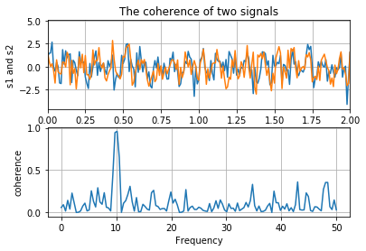

---
redirect_from:
  - "/03-python/02/00-basics"
interact_link: content/03_python/02/00_basics.ipynb
kernel_name: python3
has_widgets: false
title: 'Python Basics'
prev_page:
  url: /03_python/01/04_pep8.html
  title: 'Style guide (PEP8)'
next_page:
  url: /03_python/02/01_expressions.html
  title: 'Syntax and Expressions'
comment: "***PROGRAMMATICALLY GENERATED, DO NOT EDIT. SEE ORIGINAL FILES IN /content***"
---


# Python basics

In this chapter, we will cover basic Python syntax, mathematical expressions and function calls. To do this, the SpIRL textbook uses interactive tutorials made with **Jupyter notebooks**

## Interactive SpIRL tutorials

SpIRL is intended to be practical and hands-on, so we encourage you to either run the code blocks in Python on your own machine, or using the interactive notebooks to practice your programming skills!

### Mybinder

If you are viewing this on the SpIRL website, there should be an `Interact` button at the top of the page. That link will take you to a site called `mybinder.org` which allows you to run, modify and write new code in code blocks like the one below. Don't worry - this won't change the website so feel free to play around with the code on `mybinder`.

### Thebelab

There should also be a `Thebelab` button, which is an experimental feature that lets you to run code *directly in your web browser*! This allows you to run the programming tutorials without ever leaving the SpIRL website. As this is still experimental, it may be slow or not work on all machines. Again - this won't modify the website so feel free to explore and try new things in the code blocks. Simply refresh the page to get the original code back.

Finally, the following is a brief intro to the Jupyter Notebook so that you can follow along with tutorials. We will revisit Jupyter notebooks in a future section where we'll learn how they can be used to make descriptive, reproducible analyses that can be shared with collaborators!

## This is a Jupyter Notebook

Jupyter Notebooks consist of **cells** that contain either text or Python code. 

This is a text (`Markdown`) cell. It supports basic text formatting with Markdown (cheatsheet [here](https://github.com/adam-p/markdown-here/wiki/Markdown-Cheatsheet)) and can be used to descibe the code that preceeds or follows it. 

The cell below is a `Code` cell. You can quickly write and run Python in `Code` cells, and any outputs or plots will be shown directly below them.


<div markdown="1" class="cell code_cell">
<div class="input_area" markdown="1">
```python
# This is a code cell.
# Any outputs of code written here will appear directly below.
print('Hello World')

```
</div>

<div class="output_wrapper" markdown="1">
<div class="output_subarea" markdown="1">
{:.output_stream}
```
Hello World
```
</div>
</div>
</div>


## Editing blocks
You can edit any block by double clicking it to enter edit mode. If you are on `mybinder.org`, you can double click me to edit!


## Running cells
To run a cell, click the cell to select it, and then click the `>| Run` button above. Alternatively, you can select a cell and press `Ctrl+Enter` on your keyboard.

Try running the block below.


<div markdown="1" class="cell code_cell">
<div class="input_area" markdown="1">
```python
print("You can run me by selecting me and clicking Run")

```
</div>

<div class="output_wrapper" markdown="1">
<div class="output_subarea" markdown="1">
{:.output_stream}
```
You can run me by selecting me and clicking Run
```
</div>
</div>
</div>


## Making new cells
You can make a new cell by clicking the `+` button in the toolbar above. New cells default to the`Code` cell type. You can change the type of a cell in the dropdown menu above.

Try adding a `Markdown` cell below. Write something surrounded by asterisks (e.g. `**wow**`) and then click `>| Run` to render your new cell.


## Cool plots
Jupyter notebooks also allow you display plots and graphics inline. Try running the following two code blocks (don't worry about the code for now).


<div markdown="1" class="cell code_cell">
<div class="input_area" markdown="1">
```python
# This will install the numpy and matplotlib packages to show the following plot
import sys
!conda install -q --yes --prefix {sys.prefix} numpy matplotlib

import numpy as np
import matplotlib.pyplot as plt

```
</div>

<div class="output_wrapper" markdown="1">
<div class="output_subarea" markdown="1">
{:.output_stream}
```
Collecting package metadata (current_repodata.json): ...working... done
Solving environment: ...working... done

# All requested packages already installed.

```
</div>
</div>
</div>


<div markdown="1" class="cell code_cell">
<div class="input_area" markdown="1">
```python
# Taken from the matplotlib examples gallery: https://matplotlib.org/gallery/ (full url below)
# https://matplotlib.org/gallery/lines_bars_and_markers/cohere.html#sphx-glr-gallery-lines-bars-and-markers-cohere-pym https://matplotlib.org/gallery/lines_bars_and_markers/cohere.html#sphx-glr-gallery-lines-bars-and-markers-cohere-py


# Fixing random state for reproducibility
np.random.seed(19680801)

dt = 0.01
t = np.arange(0, 30, dt)
nse1 = np.random.randn(len(t))                 # white noise 1
nse2 = np.random.randn(len(t))                 # white noise 2

# Two signals with a coherent part at 10Hz and a random part
s1 = np.sin(2 * np.pi * 10 * t) + nse1
s2 = np.sin(2 * np.pi * 10 * t) + nse2

fig, axs = plt.subplots(2, 1)
axs[0].plot(t, s1, t, s2)
axs[0].set_xlim(0, 2)
axs[0].set_xlabel('time')
axs[0].set_ylabel('s1 and s2')
axs[0].grid(True)
axs[0].set_title('The coherence of two signals')

cxy, f = axs[1].cohere(s1, s2, 256, 1. / dt)
axs[1].set_ylabel('coherence')

# fig.tight_layout()
plt.show()

```
</div>

<div class="output_wrapper" markdown="1">
<div class="output_subarea" markdown="1">

{:.output_png}


</div>
</div>
</div>


## Other options
Note some other buttons on the toolbar above:
- save: Saves the notebook. Your notebook will also autosave every few minutes.
- cut, copy, and paste: Duplicate or move cells.
- stop, refresh, fast-forward: These stop, restart and re-run the **kernel**.

**Kernels**: Underlying the Jupyter notebook is an **IPython** kernel which is interpreting the code and rendering the pretty graphics. Sometimes this kernel gets bogged down or crashes and needs to be restarted. Try clicking the fast-forward button (restart kernel and re-run notebook). This will clear all outputs and rerun the notebook from the top down.


## Jupyter in action

We will revisit using Jupyter for science later in this textbook, but until then you can see the power of Jupyter by checking out LIGO's tutorial for finding gravitational waves on mybinder (click the link, wait for mybinder to load, then click `index.ipynb`):

https://mybinder.org/repo/losc-tutorial/LOSC_Event_tutorial

