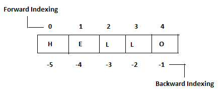

---
redirect_from:
  - "/03-python/03/03-str"
interact_link: content/03_python/03/03_str.ipynb
kernel_name: python3
has_widgets: false
title: 'String (str)'
prev_page:
  url: /03_python/03/02_int-float.html
  title: 'Numerical (int, float)'
next_page:
  url: /03_python/03/04_list-tuple.html
  title: 'List and Tuple'
comment: "***PROGRAMMATICALLY GENERATED, DO NOT EDIT. SEE ORIGINAL FILES IN /content***"
---


## Strings
In Python, the **string** is used to store text. Strings can be created with either single quotes `''` or double quotes `""`. Although both work, it is good practice to choose one or the other and stick with it for consistency.


### Indexing
A particular **character** in a string can be accessed by its **index**. Python uses the square brackets `[]` to denote indices.

**Note**: Some languages start indexing at 0, and some start at 1. In Python, **indexing starts at 0**.

Python also allows you to use **negative indices** to access characters from the end of the string. The forward and backwards indices are summarized in image below:



For example:


<div markdown="1" class="cell code_cell">
<div class="input_area" markdown="1">
```python
mystring = 'Hello World'

#Get the 2nd character in the string
print(mystring[1])

#Get the last character
print(mystring[-1])

```
</div>

<div class="output_wrapper" markdown="1">
<div class="output_subarea" markdown="1">
{:.output_stream}
```
e
d
```
</div>
</div>
</div>


### Slicing
You can also extract a range of characters from a string by taking a **slice**. Slicing in Python is again done with square brackets, but this time we need to provide a start index, a stop index, and a colon `string[start:stop]`.

**Note**: The stop index in Python is *one higher than the last character you want to slice*. E.g. if you sliced from 0 to 3, you would get the 0th, 1st, and 2nd characters (`'Hello[0:3] == 'Hel'`). The character at index 3 is not included!

If you do not provide a start index, Python assumes you want all characters from the beginning of the string to the stop index (`'Hello'[:3] == 'Hel'`). 

Likewise, if you do not provide a stop index, Python assumes you want all characters from the start index to the end of the string (`'Hello[2:] == 'llo'`).

What do you think the slice `'Hello'[:]` produces? Try it and see if you were right.

Also try indexing the string to get various letter combinations.


<div markdown="1" class="cell code_cell">
<div class="input_area" markdown="1">
```python
'Hello'[:]

```
</div>

</div>

