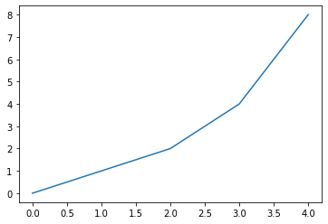

---
redirect_from:
  - "/03-python/08/00-modules"
interact_link: content/03_python/08/00_modules.ipynb
kernel_name: python3
has_widgets: false
title: 'Modules'
prev_page:
  url: /03_python/07/02_dict.html
  title: 'Dictionary (dict)'
next_page:
  url: /04_sci-programming/00_why-sci-programming.html
  title: 'Scientific Programming'
comment: "***PROGRAMMATICALLY GENERATED, DO NOT EDIT. SEE ORIGINAL FILES IN /content***"
---


# Modules

A package can have one of more **modules** in it. A module is a single Python file which defines one or more functions that can be used elsewhere in your code by using an `import` statement.

If you have Python installed on your PC, try saving the following as a file called `square_module.py`:

```Python
def square(x):
    """ 
    Return the squared value of x.
    
    Parameter
    ---------
    x: num
        Value to square.
    
    Return
    ------
    square: num
        Squared value of x.
    """
    return x**2

print(square(7))
```

You can now run this file from the shell by typing:

```Bash
Python square_module.py
# 49
```

Great, our number was squared! Now say we want to use the `square()` function in another Python program. In a new file in the same directory, type the following and save it as `run_square.py`:

```Python
print(square(7))
```

Uh oh! Python doesn't know about the `square()` function that we wrote in the other program. Let's `import` our other program as a **module** so that we can use functions in it.

Open `run_square.py` again and add an `import` statement to the following line to the **top** of the file. Then update the `square()` function line. We can call fucntions from imported modules by naming the module and following it with a `.` and finally the function (e.g. `module.function()`):

```Python
import square_module
print(square_module.square(7))
```

Now try runnning our new program.

```Bash

Python run_square.py
```


## Importing modules

We learned above that to make a module's functions accessible in a script, we need to `import` it. By convention, we write all import statements at the top of our Python programs. 

If a package has multiple modules, we can specify a single module to import with `import packagename.modulename`. Functions from an imported module can be invoked with a dot `.` after the name of the module they are found in.


<div markdown="1" class="cell code_cell">
<div class="input_area" markdown="1">
```python
#===========================================================
# Run this cell ONLY if you are viewing this on mybinder.org
#import sys
#!conda install --yes --prefix {sys.prefix} numpy matplotlib
#===========================================================

```
</div>

</div>


<div markdown="1" class="cell code_cell">
<div class="input_area" markdown="1">
```python
import matplotlib.pyplot # Imports the pyplot module within the matplotlib package

```
</div>

</div>


<div markdown="1" class="cell code_cell">
<div class="input_area" markdown="1">
```python
x = (0, 1, 2, 3, 4)
y = (0, 1, 2, 4, 8)

matplotlib.pyplot.plot(x, y) # The plot function in the pyplot module

```
</div>

<div class="output_wrapper" markdown="1">
<div class="output_subarea" markdown="1">


{:.output_data_text}
```
[<matplotlib.lines.Line2D at 0x7fe2e0260320>]
```


</div>
</div>
<div class="output_wrapper" markdown="1">
<div class="output_subarea" markdown="1">

{:.output_png}


</div>
</div>
</div>


Wow. `matplotlib.pyplot.plot()` is a lot of typing to plot a simple function. Luckily Python gives us a way to make the usage of `pyplot` much shorter.


## Import as
Python allows you to set up shorthand notation (an *alias*) to refer to a package or module. In this case, you write `import package.module as abbr`. Now `abbr` refers to your imported module and you can call functions with `abbr.function()`.


<div markdown="1" class="cell code_cell">
<div class="input_area" markdown="1">
```python
import matplotlib.pyplot as plt # Define the short form plt for matplotlib.pyplot

```
</div>

</div>


<div markdown="1" class="cell code_cell">
<div class="input_area" markdown="1">
```python
plt.plot(x, y) # Now we can write plt.func() instead of matplotlib.pyplot.func()

```
</div>

<div class="output_wrapper" markdown="1">
<div class="output_subarea" markdown="1">


{:.output_data_text}
```
[<matplotlib.lines.Line2D at 0x7fe2c0fbda90>]
```


</div>
</div>
<div class="output_wrapper" markdown="1">
<div class="output_subarea" markdown="1">

{:.output_png}


</div>
</div>
</div>


This key takeaway of this brief overview is that modules are simply Python files that we can `import` functions from for use elsewhere in our code. 

As we will see in the next chapter, we often want to import functions written and test by others, and a common way to do this is by install a **packages** which provides one or more *modules* that we can use in our own code. The plotting package we saw above, `matplotlib` is just one of many large open source packages developed by the Python community. We will explore some of the most common scientific Python packages in the following chapter.

