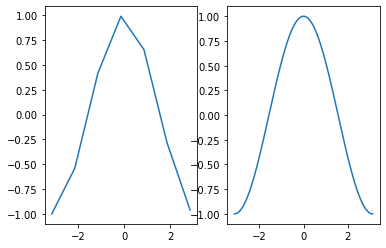
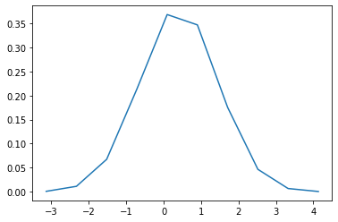
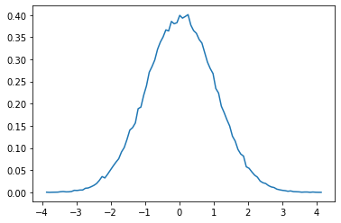

---
redirect_from:
  - "/04-sci-programming/02/00-numpy"
interact_link: content/04_sci-programming/02/00_numpy.ipynb
kernel_name: python3
has_widgets: false
title: 'Numpy'
prev_page:
  url: /04_sci-programming/01/00_jupyter.html
  title: 'Jupyter'
next_page:
  url: /04_sci-programming/03/00_matplotlib.html
  title: 'Matplotlib'
comment: "***PROGRAMMATICALLY GENERATED, DO NOT EDIT. SEE ORIGINAL FILES IN /content***"
---


# Numpy

The basis of most scientific programming in Pyhton is the *numerical Python* library, `numpy`. NumPy gives us many tools - including a fast and efficient data type, the `numpy Array` - for working with numerical data. 

## Numpy Array

NumPy is built around the `array`. This is a data structure defined in NumPy which is *ordered* and *mutable*, must like the `list`. Although very similar to the list, the numpy array only allows *numerical* data as elements, like the `int` and `float`. Let's explore!


<div markdown="1" class="cell code_cell">
<div class="input_area" markdown="1">
```python
# Frist we need to import the numpy package. It is commonly shortened to "np"
import numpy as np 

```
</div>

</div>


The easiest way to define numpy arrays is to define a list or tuple, and convert it to an array with the `numpy.array()` function.


<div markdown="1" class="cell code_cell">
<div class="input_area" markdown="1">
```python
a = [0, 1, 2, 3, 4]
b = np.array(a)
print(type(a))
print(type(b))

```
</div>

<div class="output_wrapper" markdown="1">
<div class="output_subarea" markdown="1">
{:.output_stream}
```
<class 'list'>
<class 'numpy.ndarray'>
```
</div>
</div>
</div>


We can index and slice numpy arrays much like lists:


<div markdown="1" class="cell code_cell">
<div class="input_area" markdown="1">
```python
print(b[0], b[1:3], b[-1])

```
</div>

<div class="output_wrapper" markdown="1">
<div class="output_subarea" markdown="1">
{:.output_stream}
```
0 [1 2] 4
```
</div>
</div>
</div>


Try running the following to get help on the NumPy array


<div markdown="1" class="cell code_cell">
<div class="input_area" markdown="1">
```python
help(np.ndarray)

```
</div>

</div>


Woah. That's a really long help page. Often when you are working with a new package, `help()` won't be the most convenient or easy to read way to get help. Instead, we can search for online *documentation* for the package we are using.

If you Google **numpy documentation**, you will likely see links to info about *numpy* and another package we will explore later, *scipy*. If you follow the links to **NumPy**, you should find a [NumPy user Guide](https://docs.scipy.org/doc/numpy-1.15.0/user/index.html) and from there, several pages of tutorials and documentation about the package. The [Quickstart tutorial](https://docs.scipy.org/doc/numpy-1.15.0/user/quickstart.html), will give a much more legible intro to the package.

## Numpy Attributes

NumPy arrays have some built in **attributes**, i.e. info stored in an object, accessible with `object.attribute` (note: no parentheses after).


<div markdown="1" class="cell code_cell">
<div class="input_area" markdown="1">
```python
# Let's print some attributes of our b array
print("Num dimensions:", b.ndim,
      "\nShape:", b.shape,
      "\nSize:", b.size)

```
</div>

<div class="output_wrapper" markdown="1">
<div class="output_subarea" markdown="1">
{:.output_stream}
```
Num dimensions: 1 
Shape: (5,) 
Size: 5
```
</div>
</div>
</div>


A common way to define NumPy arrays with with the `arange` function.


<div markdown="1" class="cell code_cell">
<div class="input_area" markdown="1">
```python
np.arange(10)

```
</div>

<div class="output_wrapper" markdown="1">
<div class="output_subarea" markdown="1">


{:.output_data_text}
```
array([0, 1, 2, 3, 4, 5, 6, 7, 8, 9])
```


</div>
</div>
</div>


<div markdown="1" class="cell code_cell">
<div class="input_area" markdown="1">
```python
help(np.arange)

```
</div>

</div>


The numpy `arange` function allows us to quickly build integer arrays. It takes `start`, `stop`, and `step` as arguments.


<div markdown="1" class="cell code_cell">
<div class="input_area" markdown="1">
```python
x = np.arange(1, 10)
y = np.arange(2, 20, 2)
print(x)
print(y)

```
</div>

<div class="output_wrapper" markdown="1">
<div class="output_subarea" markdown="1">
{:.output_stream}
```
[1 2 3 4 5 6 7 8 9]
[ 2  4  6  8 10 12 14 16 18]
```
</div>
</div>
</div>


We can apply any mathematical operation to a NumPy array, and it will apply that operation to every element in the array.


<div markdown="1" class="cell code_cell">
<div class="input_area" markdown="1">
```python
x = np.arange(-3, 4)
y = x**2
print(y)

```
</div>

<div class="output_wrapper" markdown="1">
<div class="output_subarea" markdown="1">
{:.output_stream}
```
[9 4 1 0 1 4 9]
```
</div>
</div>
</div>


Another way to make NumPy arrays is with the `linspace()` function. This allows us to choose the bounds of an interval and the number of points we want to divide it into. Numpy also has useful math constants like `pi` and `e` and math functions like `sin`, `cos`, `tan`.


<div markdown="1" class="cell code_cell">
<div class="input_area" markdown="1">
```python
import matplotlib.pyplot as plt

```
</div>

</div>


<div markdown="1" class="cell code_cell">
<div class="input_area" markdown="1">
```python
x = np.linspace(-2*np.pi, 2*np.pi, 100)
y = np.sin(x)
plt.plot(x, y)

```
</div>

<div class="output_wrapper" markdown="1">
<div class="output_subarea" markdown="1">


{:.output_data_text}
```
[<matplotlib.lines.Line2D at 0x7fedf64a8e80>]
```


</div>
</div>
<div class="output_wrapper" markdown="1">
<div class="output_subarea" markdown="1">

{:.output_png}


</div>
</div>
</div>


<div markdown="1" class="cell code_cell">
<div class="input_area" markdown="1">
```python
# Linspace can be useful for adding more resolution to continuous functions
xarange = np.arange(-np.pi, np.pi)
yarange = np.cos(xarange)

xlinspace = np.linspace(-np.pi, np.pi, 1000)
ylinspace = np.cos(xlinspace)

plt.subplot(1, 2, 1)
plt.plot(xarange, yarange)

plt.subplot(1, 2, 2)
plt.plot(xlinspace, ylinspace)

```
</div>

<div class="output_wrapper" markdown="1">
<div class="output_subarea" markdown="1">


{:.output_data_text}
```
[<matplotlib.lines.Line2D at 0x7fedcb5fdc50>]
```


</div>
</div>
<div class="output_wrapper" markdown="1">
<div class="output_subarea" markdown="1">

{:.output_png}


</div>
</div>
</div>


If we want to plot a bell curve we can use the `np.random` module to randomly sample a normal distribution.


<div markdown="1" class="cell code_cell">
<div class="input_area" markdown="1">
```python
norm = np.random.standard_normal(100000) # Draw 1000 random points from normal distribution
hist, bins = np.histogram(norm, bins=10, density=True) # Make histogram of our samples
plt.plot(bins[1:], hist)

```
</div>

<div class="output_wrapper" markdown="1">
<div class="output_subarea" markdown="1">


{:.output_data_text}
```
[<matplotlib.lines.Line2D at 0x7fedcb35f6a0>]
```


</div>
</div>
<div class="output_wrapper" markdown="1">
<div class="output_subarea" markdown="1">

{:.output_png}


</div>
</div>
</div>


<div markdown="1" class="cell code_cell">
<div class="input_area" markdown="1">
```python
hist, bins = np.histogram(norm, bins=100, density=True)
plt.plot(bins[1:], hist)

```
</div>

<div class="output_wrapper" markdown="1">
<div class="output_subarea" markdown="1">


{:.output_data_text}
```
[<matplotlib.lines.Line2D at 0x7fedcb2c5b00>]
```


</div>
</div>
<div class="output_wrapper" markdown="1">
<div class="output_subarea" markdown="1">

{:.output_png}


</div>
</div>
</div>


This is barely scratching the surface of the `numpy` package, but should be enough to get you started. The [Quickstart tutorial](https://docs.scipy.org/doc/numpy-1.15.0/user/quickstart.html) is a great resource for more of the basics and some more advanced usage. Finally, don't forget to use the most powerful tool at our disposal: *Google*. Most programmers only have the most common syntax memorized, everything else can be found with Google!

Next we will further explore the `matplotlob` package that we briefly introduced above!

