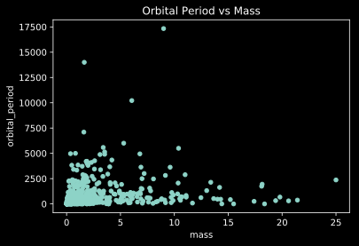

---
redirect_from:
  - "/04-sci-programming/05/00-pandas"
interact_link: content/04_sci-programming/05/00_pandas.ipynb
kernel_name: 
has_widgets: false
title: 'Pandas'
prev_page:
  url: /04_sci-programming/04/00_scipy.html
  title: 'Scipy'
next_page:
  url: /05_anaconda/00_why-anaconda.html
  title: 'Anaconda'
comment: "***PROGRAMMATICALLY GENERATED, DO NOT EDIT. SEE ORIGINAL FILES IN /content***"
---


# Pandas

In this tutorial we will learn to work with tables of data with the `pandas` Python package. Pandas is an industry standard analysis package for data science, so it has many features and is actively being updated and supported (full documentation [here](https://pandas.pydata.org/pandas-docs/stable/)).

## Overview

Pandas has two main data structures that it uses to store tables of data, the **Series** and the **DataFrame**. 

- The **Series** represents a single column of data
- The **DataFrame** is a collention of **Series** columns that make a table

Let's start by exploring the DataFrame in pandas!


<div markdown="1" class="cell code_cell">
<div class="input_area" markdown="1">
```python
# Pandas is commonly aliased as pd
import pandas as pd

```
</div>

</div>


## Creating DataFrames

In the `dict` chapter, we saw that dictionaries can be used to represent tables of data. As you may expect, DataFrames can be created directly from dictionaries!


<div markdown="1" class="cell code_cell">
<div class="input_area" markdown="1">
```python
# Daily coffee consumption over 4 weeks
coffees = {
    'Week': ['Sep 2', 'Sep 9', 'Sep 16', 'Sep 23'],
    'Monday': [2, 1, 2, 3],
    'Tuesday': [1, 2, 1, 2],
    'Wednesday': [1, 1, 2, 1],
    'Thursday': [1, 2, 1, 2],
    'Friday': [1, 1, 3, 3]
}
df = pd.DataFrame(coffees)
print(type(df))
df

```
</div>

<div class="output_wrapper" markdown="1">
<div class="output_subarea" markdown="1">
{:.output_stream}
```
<class 'pandas.core.frame.DataFrame'>
```
</div>
</div>
<div class="output_wrapper" markdown="1">
<div class="output_subarea" markdown="1">


<div markdown="0" class="output output_html">
<div>
<style scoped>
    .dataframe tbody tr th:only-of-type {
        vertical-align: middle;
    }

    .dataframe tbody tr th {
        vertical-align: top;
    }

    .dataframe thead th {
        text-align: right;
    }
</style>
<table border="1" class="dataframe">
  <thead>
    <tr style="text-align: right;">
      <th></th>
      <th>Week</th>
      <th>Monday</th>
      <th>Tuesday</th>
      <th>Wednesday</th>
      <th>Thursday</th>
      <th>Friday</th>
    </tr>
  </thead>
  <tbody>
    <tr>
      <th>0</th>
      <td>Sep 2</td>
      <td>2</td>
      <td>1</td>
      <td>1</td>
      <td>1</td>
      <td>1</td>
    </tr>
    <tr>
      <th>1</th>
      <td>Sep 9</td>
      <td>1</td>
      <td>2</td>
      <td>1</td>
      <td>2</td>
      <td>1</td>
    </tr>
    <tr>
      <th>2</th>
      <td>Sep 16</td>
      <td>2</td>
      <td>1</td>
      <td>2</td>
      <td>1</td>
      <td>3</td>
    </tr>
    <tr>
      <th>3</th>
      <td>Sep 23</td>
      <td>3</td>
      <td>2</td>
      <td>1</td>
      <td>2</td>
      <td>3</td>
    </tr>
  </tbody>
</table>
</div>
</div>


</div>
</div>
</div>


We get see the column names using the `.columns` attribute.


<div markdown="1" class="cell code_cell">
<div class="input_area" markdown="1">
```python
df.columns

```
</div>

<div class="output_wrapper" markdown="1">
<div class="output_subarea" markdown="1">


{:.output_data_text}
```
Index(['Week', 'Monday', 'Tuesday', 'Wednesday', 'Thursday', 'Friday'], dtype='object')
```


</div>
</div>
</div>


## Slicing and Indexing

Pandas gives a few ways to find your data in a **DataFrame**.

- `[]` raw indexing by *column* like we've seen in `dict`
- `.loc[]` **loc**ate *row* by name
- `.iloc[]` **loc**ate *row* by numerical **i**ndex

Let's try each of these on a subset of our `exoplanets` DataFrame.


<div markdown="1" class="cell code_cell">
<div class="input_area" markdown="1">
```python
df['Monday']

```
</div>

<div class="output_wrapper" markdown="1">
<div class="output_subarea" markdown="1">


{:.output_data_text}
```
0    2
1    1
2    2
3    3
Name: Monday, dtype: int64
```


</div>
</div>
</div>


<div markdown="1" class="cell code_cell">
<div class="input_area" markdown="1">
```python
# try locating a row by its week
df.loc['Sep 2']

```
</div>

</div>


Uh oh, we didn't tell pandas which of the columns to use as our `Index`. The `Index` is an optional unique identifier of a rows, like a *name*, *ID*, or in our case, the *week*. Let's add an `Index` to our DataFrame.


<div markdown="1" class="cell code_cell">
<div class="input_area" markdown="1">
```python
df = df.set_index('Week')
df.head()

```
</div>

<div class="output_wrapper" markdown="1">
<div class="output_subarea" markdown="1">


<div markdown="0" class="output output_html">
<div>
<style scoped>
    .dataframe tbody tr th:only-of-type {
        vertical-align: middle;
    }

    .dataframe tbody tr th {
        vertical-align: top;
    }

    .dataframe thead th {
        text-align: right;
    }
</style>
<table border="1" class="dataframe">
  <thead>
    <tr style="text-align: right;">
      <th></th>
      <th>Monday</th>
      <th>Tuesday</th>
      <th>Wednesday</th>
      <th>Thursday</th>
      <th>Friday</th>
    </tr>
    <tr>
      <th>Week</th>
      <th></th>
      <th></th>
      <th></th>
      <th></th>
      <th></th>
    </tr>
  </thead>
  <tbody>
    <tr>
      <th>Sep 2</th>
      <td>2</td>
      <td>1</td>
      <td>1</td>
      <td>1</td>
      <td>1</td>
    </tr>
    <tr>
      <th>Sep 9</th>
      <td>1</td>
      <td>2</td>
      <td>1</td>
      <td>2</td>
      <td>1</td>
    </tr>
    <tr>
      <th>Sep 16</th>
      <td>2</td>
      <td>1</td>
      <td>2</td>
      <td>1</td>
      <td>3</td>
    </tr>
    <tr>
      <th>Sep 23</th>
      <td>3</td>
      <td>2</td>
      <td>1</td>
      <td>2</td>
      <td>3</td>
    </tr>
  </tbody>
</table>
</div>
</div>


</div>
</div>
</div>


Now we can use `.loc[]` to find rows by their Index name!


<div markdown="1" class="cell code_cell">
<div class="input_area" markdown="1">
```python
df.loc['Sep 2']

```
</div>

<div class="output_wrapper" markdown="1">
<div class="output_subarea" markdown="1">


{:.output_data_text}
```
Monday       2
Tuesday      1
Wednesday    1
Thursday     1
Friday       1
Name: Sep 2, dtype: int64
```


</div>
</div>
</div>


Finally, we can also specify a rows from our DataFrame by its *numerical* index using `.iloc[]`.


<div markdown="1" class="cell code_cell">
<div class="input_area" markdown="1">
```python
# Get first row in the DataFrame
df.iloc[0]

```
</div>

<div class="output_wrapper" markdown="1">
<div class="output_subarea" markdown="1">


{:.output_data_text}
```
Monday       2
Tuesday      1
Wednesday    1
Thursday     1
Friday       1
Name: Sep 2, dtype: int64
```


</div>
</div>
</div>


## DataFrame methods

Now let's read in an example dataset to learn about a few other useful DataFrame methods.


<div markdown="1" class="cell code_cell">
<div class="input_area" markdown="1">
```python
exoplanets = pd.read_csv("https://github.com/mwaskom/seaborn-data/raw/master/planets.csv")

```
</div>

</div>


We can check that `pandas` read the table in as a **DataFrame**.


<div markdown="1" class="cell code_cell">
<div class="input_area" markdown="1">
```python
type(exoplanets)

```
</div>

<div class="output_wrapper" markdown="1">
<div class="output_subarea" markdown="1">


{:.output_data_text}
```
pandas.core.frame.DataFrame
```


</div>
</div>
</div>


The `DataFrame.info()` method can tell us about the contents of our table.


<div markdown="1" class="cell code_cell">
<div class="input_area" markdown="1">
```python
print(exoplanets.info())

```
</div>

<div class="output_wrapper" markdown="1">
<div class="output_subarea" markdown="1">
{:.output_stream}
```
<class 'pandas.core.frame.DataFrame'>
RangeIndex: 1035 entries, 0 to 1034
Data columns (total 6 columns):
method            1035 non-null object
number            1035 non-null int64
orbital_period    992 non-null float64
mass              513 non-null float64
distance          808 non-null float64
year              1035 non-null int64
dtypes: float64(3), int64(2), object(1)
memory usage: 48.6+ KB
None
```
</div>
</div>
</div>


In the above description, we get the total number of rows (the **RangeIndex**), and the number of non-null entries in each of the columns.

We can get a sense for what the table looks like by printing the first few rows with the `DataFrame.head(num_rows)` method. You can specify a number of rows to `.head()`, otherwise it shows the first 5 by default.


<div markdown="1" class="cell code_cell">
<div class="input_area" markdown="1">
```python
exoplanets.head()

```
</div>

<div class="output_wrapper" markdown="1">
<div class="output_subarea" markdown="1">


<div markdown="0" class="output output_html">
<div>
<style scoped>
    .dataframe tbody tr th:only-of-type {
        vertical-align: middle;
    }

    .dataframe tbody tr th {
        vertical-align: top;
    }

    .dataframe thead th {
        text-align: right;
    }
</style>
<table border="1" class="dataframe">
  <thead>
    <tr style="text-align: right;">
      <th></th>
      <th>method</th>
      <th>number</th>
      <th>orbital_period</th>
      <th>mass</th>
      <th>distance</th>
      <th>year</th>
    </tr>
  </thead>
  <tbody>
    <tr>
      <th>0</th>
      <td>Radial Velocity</td>
      <td>1</td>
      <td>269.300</td>
      <td>7.10</td>
      <td>77.40</td>
      <td>2006</td>
    </tr>
    <tr>
      <th>1</th>
      <td>Radial Velocity</td>
      <td>1</td>
      <td>874.774</td>
      <td>2.21</td>
      <td>56.95</td>
      <td>2008</td>
    </tr>
    <tr>
      <th>2</th>
      <td>Radial Velocity</td>
      <td>1</td>
      <td>763.000</td>
      <td>2.60</td>
      <td>19.84</td>
      <td>2011</td>
    </tr>
    <tr>
      <th>3</th>
      <td>Radial Velocity</td>
      <td>1</td>
      <td>326.030</td>
      <td>19.40</td>
      <td>110.62</td>
      <td>2007</td>
    </tr>
    <tr>
      <th>4</th>
      <td>Radial Velocity</td>
      <td>1</td>
      <td>516.220</td>
      <td>10.50</td>
      <td>119.47</td>
      <td>2009</td>
    </tr>
  </tbody>
</table>
</div>
</div>


</div>
</div>
</div>


Similarly, we can print rows from the bottom of the table with the `.tail(num_rows)` method. Here we are printing the bottom 2 rows.


<div markdown="1" class="cell code_cell">
<div class="input_area" markdown="1">
```python
exoplanets.tail(2)

```
</div>

<div class="output_wrapper" markdown="1">
<div class="output_subarea" markdown="1">


<div markdown="0" class="output output_html">
<div>
<style scoped>
    .dataframe tbody tr th:only-of-type {
        vertical-align: middle;
    }

    .dataframe tbody tr th {
        vertical-align: top;
    }

    .dataframe thead th {
        text-align: right;
    }
</style>
<table border="1" class="dataframe">
  <thead>
    <tr style="text-align: right;">
      <th></th>
      <th>method</th>
      <th>number</th>
      <th>orbital_period</th>
      <th>mass</th>
      <th>distance</th>
      <th>year</th>
    </tr>
  </thead>
  <tbody>
    <tr>
      <th>1033</th>
      <td>Transit</td>
      <td>1</td>
      <td>4.125083</td>
      <td>NaN</td>
      <td>293.0</td>
      <td>2008</td>
    </tr>
    <tr>
      <th>1034</th>
      <td>Transit</td>
      <td>1</td>
      <td>4.187757</td>
      <td>NaN</td>
      <td>260.0</td>
      <td>2008</td>
    </tr>
  </tbody>
</table>
</div>
</div>


</div>
</div>
</div>


## Null data

Dealing with missing data is a major strength of `pandas`. Pandas fills in missing data with a value of `NaN`, but these can be challenging to deal with because many math operations are amiguous or undefined on `NaN` values.

Let's get a list of where the values are in our DataFrame are missing with `.isnull()`. This will give a DataFrame of `bool` with whether or not each entry is null. Below, we use `.tail()` to just print the last 5 rows.


<div markdown="1" class="cell code_cell">
<div class="input_area" markdown="1">
```python
exoplanets.isnull().tail()

```
</div>

<div class="output_wrapper" markdown="1">
<div class="output_subarea" markdown="1">


<div markdown="0" class="output output_html">
<div>
<style scoped>
    .dataframe tbody tr th:only-of-type {
        vertical-align: middle;
    }

    .dataframe tbody tr th {
        vertical-align: top;
    }

    .dataframe thead th {
        text-align: right;
    }
</style>
<table border="1" class="dataframe">
  <thead>
    <tr style="text-align: right;">
      <th></th>
      <th>method</th>
      <th>number</th>
      <th>orbital_period</th>
      <th>mass</th>
      <th>distance</th>
      <th>year</th>
    </tr>
  </thead>
  <tbody>
    <tr>
      <th>1030</th>
      <td>False</td>
      <td>False</td>
      <td>False</td>
      <td>True</td>
      <td>False</td>
      <td>False</td>
    </tr>
    <tr>
      <th>1031</th>
      <td>False</td>
      <td>False</td>
      <td>False</td>
      <td>True</td>
      <td>False</td>
      <td>False</td>
    </tr>
    <tr>
      <th>1032</th>
      <td>False</td>
      <td>False</td>
      <td>False</td>
      <td>True</td>
      <td>False</td>
      <td>False</td>
    </tr>
    <tr>
      <th>1033</th>
      <td>False</td>
      <td>False</td>
      <td>False</td>
      <td>True</td>
      <td>False</td>
      <td>False</td>
    </tr>
    <tr>
      <th>1034</th>
      <td>False</td>
      <td>False</td>
      <td>False</td>
      <td>True</td>
      <td>False</td>
      <td>False</td>
    </tr>
  </tbody>
</table>
</div>
</div>


</div>
</div>
</div>


To get a summary of how many `NaN`s are in each column, we can use the `.sum()` method (recall that `bool` values in Python are equivalent to 0 and 1 in Python and can be summed).


<div markdown="1" class="cell code_cell">
<div class="input_area" markdown="1">
```python
exoplanets.isnull().sum()

```
</div>

<div class="output_wrapper" markdown="1">
<div class="output_subarea" markdown="1">


{:.output_data_text}
```
method              0
number              0
orbital_period     43
mass              522
distance          227
year                0
dtype: int64
```


</div>
</div>
</div>


Here we've converted each null entry to `True`, then summed each of the boolean columns. Since `False == 0`, we get a count of the `True == 1` (in this case the null valued) entries in each column.

To get rid of these null values, we have a few options. Sometimes we want to completely drop all rows with missing data and we can do this with `dropna()`.


<div markdown="1" class="cell code_cell">
<div class="input_area" markdown="1">
```python
exo = exoplanets.dropna()
exo.info()

```
</div>

<div class="output_wrapper" markdown="1">
<div class="output_subarea" markdown="1">
{:.output_stream}
```
<class 'pandas.core.frame.DataFrame'>
Int64Index: 498 entries, 0 to 784
Data columns (total 6 columns):
method            498 non-null object
number            498 non-null int64
orbital_period    498 non-null float64
mass              498 non-null float64
distance          498 non-null float64
year              498 non-null int64
dtypes: float64(3), int64(2), object(1)
memory usage: 27.2+ KB
```
</div>
</div>
</div>


Now we have 498 rows without missing values remaining. Let's verify this with the sum trick we saw above.


<div markdown="1" class="cell code_cell">
<div class="input_area" markdown="1">
```python
exo.isnull().sum()

```
</div>

<div class="output_wrapper" markdown="1">
<div class="output_subarea" markdown="1">


{:.output_data_text}
```
method            0
number            0
orbital_period    0
mass              0
distance          0
year              0
dtype: int64
```


</div>
</div>
</div>


If instead we want to fill the null values with some default value, we can use the `.fillna()` method.


<div markdown="1" class="cell code_cell">
<div class="input_area" markdown="1">
```python
exo_filled = exoplanets.fillna(0)
exo_filled.tail()

```
</div>

<div class="output_wrapper" markdown="1">
<div class="output_subarea" markdown="1">


<div markdown="0" class="output output_html">
<div>
<style scoped>
    .dataframe tbody tr th:only-of-type {
        vertical-align: middle;
    }

    .dataframe tbody tr th {
        vertical-align: top;
    }

    .dataframe thead th {
        text-align: right;
    }
</style>
<table border="1" class="dataframe">
  <thead>
    <tr style="text-align: right;">
      <th></th>
      <th>method</th>
      <th>number</th>
      <th>orbital_period</th>
      <th>mass</th>
      <th>distance</th>
      <th>year</th>
    </tr>
  </thead>
  <tbody>
    <tr>
      <th>1030</th>
      <td>Transit</td>
      <td>1</td>
      <td>3.941507</td>
      <td>0.0</td>
      <td>172.0</td>
      <td>2006</td>
    </tr>
    <tr>
      <th>1031</th>
      <td>Transit</td>
      <td>1</td>
      <td>2.615864</td>
      <td>0.0</td>
      <td>148.0</td>
      <td>2007</td>
    </tr>
    <tr>
      <th>1032</th>
      <td>Transit</td>
      <td>1</td>
      <td>3.191524</td>
      <td>0.0</td>
      <td>174.0</td>
      <td>2007</td>
    </tr>
    <tr>
      <th>1033</th>
      <td>Transit</td>
      <td>1</td>
      <td>4.125083</td>
      <td>0.0</td>
      <td>293.0</td>
      <td>2008</td>
    </tr>
    <tr>
      <th>1034</th>
      <td>Transit</td>
      <td>1</td>
      <td>4.187757</td>
      <td>0.0</td>
      <td>260.0</td>
      <td>2008</td>
    </tr>
  </tbody>
</table>
</div>
</div>


</div>
</div>
</div>


<div markdown="1" class="cell code_cell">
<div class="input_area" markdown="1">
```python
exo_filled.isnull().sum()

```
</div>

<div class="output_wrapper" markdown="1">
<div class="output_subarea" markdown="1">


{:.output_data_text}
```
method            0
number            0
orbital_period    0
mass              0
distance          0
year              0
dtype: int64
```


</div>
</div>
</div>


## And More

Often we want to select data from a table on some condition. Say we want all of the rows where the detection method was *microlensing*, we could do:


<div markdown="1" class="cell code_cell">
<div class="input_area" markdown="1">
```python
exoplanets[exoplanets['method'] == 'Microlensing']

```
</div>

<div class="output_wrapper" markdown="1">
<div class="output_subarea" markdown="1">


<div markdown="0" class="output output_html">
<div>
<style scoped>
    .dataframe tbody tr th:only-of-type {
        vertical-align: middle;
    }

    .dataframe tbody tr th {
        vertical-align: top;
    }

    .dataframe thead th {
        text-align: right;
    }
</style>
<table border="1" class="dataframe">
  <thead>
    <tr style="text-align: right;">
      <th></th>
      <th>method</th>
      <th>number</th>
      <th>orbital_period</th>
      <th>mass</th>
      <th>distance</th>
      <th>year</th>
    </tr>
  </thead>
  <tbody>
    <tr>
      <th>902</th>
      <td>Microlensing</td>
      <td>1</td>
      <td>NaN</td>
      <td>NaN</td>
      <td>NaN</td>
      <td>2008</td>
    </tr>
    <tr>
      <th>903</th>
      <td>Microlensing</td>
      <td>1</td>
      <td>NaN</td>
      <td>NaN</td>
      <td>NaN</td>
      <td>2008</td>
    </tr>
    <tr>
      <th>904</th>
      <td>Microlensing</td>
      <td>1</td>
      <td>NaN</td>
      <td>NaN</td>
      <td>NaN</td>
      <td>2009</td>
    </tr>
    <tr>
      <th>905</th>
      <td>Microlensing</td>
      <td>1</td>
      <td>NaN</td>
      <td>NaN</td>
      <td>3600.0</td>
      <td>2013</td>
    </tr>
    <tr>
      <th>906</th>
      <td>Microlensing</td>
      <td>1</td>
      <td>2780.0</td>
      <td>NaN</td>
      <td>NaN</td>
      <td>2011</td>
    </tr>
    <tr>
      <th>907</th>
      <td>Microlensing</td>
      <td>1</td>
      <td>NaN</td>
      <td>NaN</td>
      <td>NaN</td>
      <td>2010</td>
    </tr>
    <tr>
      <th>908</th>
      <td>Microlensing</td>
      <td>1</td>
      <td>1970.0</td>
      <td>NaN</td>
      <td>NaN</td>
      <td>2010</td>
    </tr>
    <tr>
      <th>909</th>
      <td>Microlensing</td>
      <td>1</td>
      <td>NaN</td>
      <td>NaN</td>
      <td>2300.0</td>
      <td>2012</td>
    </tr>
    <tr>
      <th>910</th>
      <td>Microlensing</td>
      <td>1</td>
      <td>NaN</td>
      <td>NaN</td>
      <td>2800.0</td>
      <td>2012</td>
    </tr>
    <tr>
      <th>911</th>
      <td>Microlensing</td>
      <td>1</td>
      <td>NaN</td>
      <td>NaN</td>
      <td>7720.0</td>
      <td>2012</td>
    </tr>
    <tr>
      <th>912</th>
      <td>Microlensing</td>
      <td>1</td>
      <td>NaN</td>
      <td>NaN</td>
      <td>7560.0</td>
      <td>2013</td>
    </tr>
    <tr>
      <th>917</th>
      <td>Microlensing</td>
      <td>1</td>
      <td>NaN</td>
      <td>NaN</td>
      <td>NaN</td>
      <td>2004</td>
    </tr>
    <tr>
      <th>918</th>
      <td>Microlensing</td>
      <td>1</td>
      <td>3600.0</td>
      <td>NaN</td>
      <td>NaN</td>
      <td>2005</td>
    </tr>
    <tr>
      <th>919</th>
      <td>Microlensing</td>
      <td>1</td>
      <td>3300.0</td>
      <td>NaN</td>
      <td>NaN</td>
      <td>2006</td>
    </tr>
    <tr>
      <th>920</th>
      <td>Microlensing</td>
      <td>1</td>
      <td>3500.0</td>
      <td>NaN</td>
      <td>NaN</td>
      <td>2005</td>
    </tr>
    <tr>
      <th>921</th>
      <td>Microlensing</td>
      <td>2</td>
      <td>1825.0</td>
      <td>NaN</td>
      <td>NaN</td>
      <td>2008</td>
    </tr>
    <tr>
      <th>922</th>
      <td>Microlensing</td>
      <td>2</td>
      <td>5100.0</td>
      <td>NaN</td>
      <td>NaN</td>
      <td>2008</td>
    </tr>
    <tr>
      <th>923</th>
      <td>Microlensing</td>
      <td>1</td>
      <td>NaN</td>
      <td>NaN</td>
      <td>NaN</td>
      <td>2009</td>
    </tr>
    <tr>
      <th>924</th>
      <td>Microlensing</td>
      <td>1</td>
      <td>NaN</td>
      <td>NaN</td>
      <td>2570.0</td>
      <td>2012</td>
    </tr>
    <tr>
      <th>925</th>
      <td>Microlensing</td>
      <td>2</td>
      <td>NaN</td>
      <td>NaN</td>
      <td>4080.0</td>
      <td>2012</td>
    </tr>
    <tr>
      <th>926</th>
      <td>Microlensing</td>
      <td>2</td>
      <td>NaN</td>
      <td>NaN</td>
      <td>4080.0</td>
      <td>2012</td>
    </tr>
    <tr>
      <th>927</th>
      <td>Microlensing</td>
      <td>1</td>
      <td>NaN</td>
      <td>NaN</td>
      <td>1760.0</td>
      <td>2013</td>
    </tr>
    <tr>
      <th>928</th>
      <td>Microlensing</td>
      <td>1</td>
      <td>NaN</td>
      <td>NaN</td>
      <td>4970.0</td>
      <td>2013</td>
    </tr>
  </tbody>
</table>
</div>
</div>


</div>
</div>
</div>


Say we want all exoplanets detected between 2009 and 2011. We can do this by combining two boolean expressions with a `&`.


<div markdown="1" class="cell code_cell">
<div class="input_area" markdown="1">
```python
exoplanets[(exoplanets['year'] >= 2009) & (exoplanets['year'] <= 2011)].info()

```
</div>

<div class="output_wrapper" markdown="1">
<div class="output_subarea" markdown="1">
{:.output_stream}
```
<class 'pandas.core.frame.DataFrame'>
Int64Index: 385 entries, 2 to 1027
Data columns (total 6 columns):
method            385 non-null object
number            385 non-null int64
orbital_period    376 non-null float64
mass              206 non-null float64
distance          331 non-null float64
year              385 non-null int64
dtypes: float64(3), int64(2), object(1)
memory usage: 21.1+ KB
```
</div>
</div>
</div>


Pandas also has a useful summary method which gives statistics on each of the columns called `.describe()`. This can be a quick way to see if the mimima, maxima and means of each column are what you expect.


<div markdown="1" class="cell code_cell">
<div class="input_area" markdown="1">
```python
exoplanets.describe()

```
</div>

<div class="output_wrapper" markdown="1">
<div class="output_subarea" markdown="1">


<div markdown="0" class="output output_html">
<div>
<style scoped>
    .dataframe tbody tr th:only-of-type {
        vertical-align: middle;
    }

    .dataframe tbody tr th {
        vertical-align: top;
    }

    .dataframe thead th {
        text-align: right;
    }
</style>
<table border="1" class="dataframe">
  <thead>
    <tr style="text-align: right;">
      <th></th>
      <th>number</th>
      <th>orbital_period</th>
      <th>mass</th>
      <th>distance</th>
      <th>year</th>
    </tr>
  </thead>
  <tbody>
    <tr>
      <th>count</th>
      <td>1035.000000</td>
      <td>992.000000</td>
      <td>513.000000</td>
      <td>808.000000</td>
      <td>1035.000000</td>
    </tr>
    <tr>
      <th>mean</th>
      <td>1.785507</td>
      <td>2002.917596</td>
      <td>2.638161</td>
      <td>264.069282</td>
      <td>2009.070531</td>
    </tr>
    <tr>
      <th>std</th>
      <td>1.240976</td>
      <td>26014.728304</td>
      <td>3.818617</td>
      <td>733.116493</td>
      <td>3.972567</td>
    </tr>
    <tr>
      <th>min</th>
      <td>1.000000</td>
      <td>0.090706</td>
      <td>0.003600</td>
      <td>1.350000</td>
      <td>1989.000000</td>
    </tr>
    <tr>
      <th>25%</th>
      <td>1.000000</td>
      <td>5.442540</td>
      <td>0.229000</td>
      <td>32.560000</td>
      <td>2007.000000</td>
    </tr>
    <tr>
      <th>50%</th>
      <td>1.000000</td>
      <td>39.979500</td>
      <td>1.260000</td>
      <td>55.250000</td>
      <td>2010.000000</td>
    </tr>
    <tr>
      <th>75%</th>
      <td>2.000000</td>
      <td>526.005000</td>
      <td>3.040000</td>
      <td>178.500000</td>
      <td>2012.000000</td>
    </tr>
    <tr>
      <th>max</th>
      <td>7.000000</td>
      <td>730000.000000</td>
      <td>25.000000</td>
      <td>8500.000000</td>
      <td>2014.000000</td>
    </tr>
  </tbody>
</table>
</div>
</div>


</div>
</div>
</div>


Finally, we can plot a dataframe directly with the `.plot()` method. This method uses `pyplot` from `matplotlib` and accepts most of the same arguments that you would pass to `matplotlib.pyplot.plot()`. The conveniece of plotting directly from a DataFrame is being able to specify the names of columns as the x and y axes.


<div markdown="1" class="cell code_cell">
<div class="input_area" markdown="1">
```python
exoplanets.plot(kind='scatter', x='mass', y='orbital_period', title='Orbital Period vs Mass')

```
</div>

<div class="output_wrapper" markdown="1">
<div class="output_subarea" markdown="1">


{:.output_data_text}
```
<matplotlib.axes._subplots.AxesSubplot at 0x2bdd25394a8>
```


</div>
</div>
<div class="output_wrapper" markdown="1">
<div class="output_subarea" markdown="1">



</div>
</div>
</div>


## Practice

We will read in the fuel economy dataset, **mpg** from https://github.com/mwaskom/seaborn-data below. 


<div markdown="1" class="cell code_cell">
<div class="input_area" markdown="1">
```python
mpg = pd.read_csv("https://github.com/mwaskom/seaborn-data/raw/master/mpg.csv")

```
</div>

</div>


1. Use the `.info()`, `.describe()`, and `.head()` methods to get acquainted with the dataset - are there null values for any columns? What is the minimum and maximum number of cylinders of cars in the dataset?
2. If any rows have null values, use `.dropna()` to remove those rows
3. Create a new variable, `mpg4` with only the 4-cylinder engine cars
4. Using the 4-cylinder car DataFrame, make a scatter plot of the *mpg* (fuel economy) vs *horsepower*
5. Plot a histogram (you can do this with `.plot(kind='hist)`) of the *mpg* for only the cars whose *origin* is "usa"


<div markdown="1" class="cell code_cell">
<div class="input_area" markdown="1">
```python
# Answer the above problems here!


```
</div>

</div>

