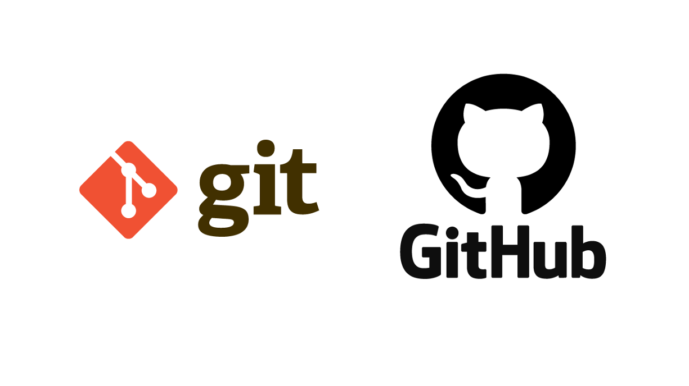

# Version control with Git

Has one of these happened to you?

- "My laptop died and I **lost** months of work!"
- "Something in my program is broken - I wish I had a **snapshot** of how it was when it worked"
- "Which **version** of my code did I send my collaborator `code_v3_oct31_2018_1_final.py` or `code_v3_nov7_2018_3.py`"?
- "My collaborator and I have been working on two different versions of this code for months. I wish I could see what they **changed** so I could **combine** them"

This section will give a practical introduction to **version control with Git** to mitigate some of these common challenges that scientists face all the time.

Git is also a common entry point to the rapidly growing **open source** movement, taking place largely on sites like **GitHub** at the moment.

**What is a Version Control System?**

Version control systems (**VCS**) were developed to solve the challenges of collaborating on code with others, a common task in both industry and academia. They provide a *framework for snapshotting* **versions** of your code.

Some common VCS include [Subversion (SVN)](https://subversion.apache.org/), [Mercurial](https://www.mercurial-scm.org/) and [Git](https://git-scm.com/). In this text we focus on Git because of its rapid rise in popularity in the open source community with the advent of popular code-hosting websites like [GitHub](https://github.com), [GitLab](https://about.gitlab.com) and [BitBucket](https://bitbucket.org).

**I don't want my code on GitHub so why bother?**

Here are some reasons you may want to use Git even if you never plan on making your code public:

1. You always have time-stamped snapshots of your code that you can revert to if you something breaks or gets deleted.

2. You can use to keep backup of your code privately (websites like GitHub are completely optional and often have a private setting).

3. You can easily keep your code up to date on multiple machines. This is very useful if you test code on your personal computer before running it on a server or in the cloud.

4. If you ever change your mind and want to publish your code or some portion of your analysis, it is really easy to push your version-controlled code to GitHub or some other site to make it public and readily accessible.

Finally, a big motivation for writing this text is to **democratize computational science**. Once you see how few steps it takes to share your code / science to GitHub, I hope you will be encouraged to set an example and use Git to make your code more accessible!
