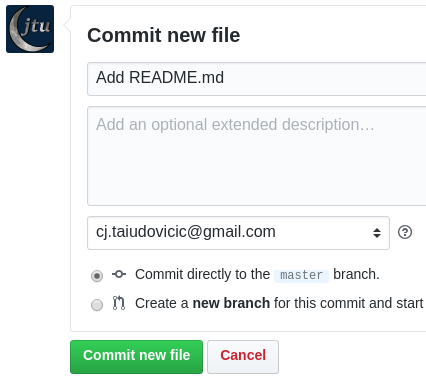
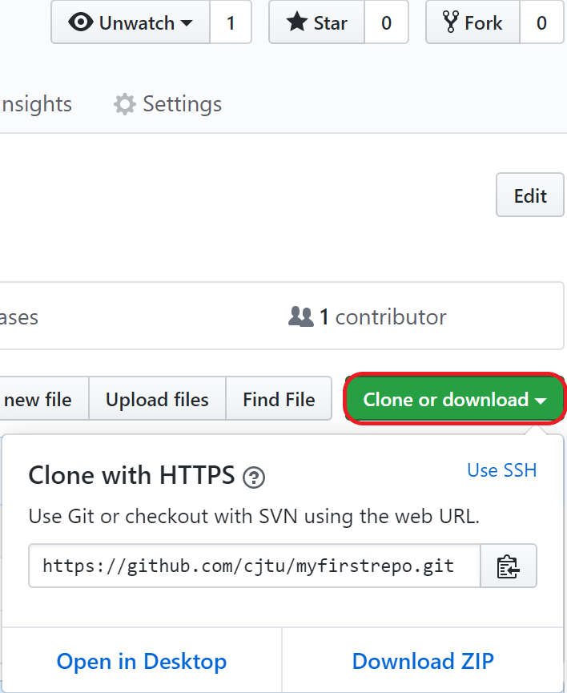

# Remotes and GitHub

Many version control newcomers initially confuse **Git** and **GitHub** (myself included!). Git is the software that we've introduced in the previous couple chapters and does the heavy lifting of keeping track of versions of our files.

## GitHub

**GitHub** is a website where Git repositories are stored/hosted. GitHub is the most popular and widely recognized open source platform in world. It is where many useful scientific packages are developed and made available to the community (e.g. astropy, emcee, scikit-learn). Fun fact, the textbook you are reading right now is simply a repository hosted on GitHub. You can browse a less pretty version of the text you are reading and all the things that make it look pretty at the main repository [here](https://github.com/cjtu/spirl).

**GitHub is currently free for academics**

GitHub allows all of its users free hosting of Git repositories to encourage open source collaboration and sharing of code. GitHub also offers students and academics a `developer pack` with some potentially useful feature. You won't need it for this course, but if you're interested in using GitHub or learning other industry tools, you can apply with your university email at one of the links below:

The **Student Developer Pack** comes with unlimited private repos and a ton of extra free stuff - grad students are students too! [Apply here](https://help.github.com/articles/applying-for-a-student-developer-pack/).

**Educators and Academic Researchers** can also apply for GitHub Pro [here](https://help.github.com/articles/about-github-education-for-educators-and-researchers/).

## Finding the remote

If you followed along from the previous chapter, you created a repository called `myfirstrepo/` on your computer. We can use Git to keep track of this repo locally, but it isn't yet backed up anywhere! What if we spill coffee on our laptop or we want to share our code?

This is where **remotes** come in. The remote tells git where another version of your repository is located. In our case, our remote will be on GitHub. You could also use an internal lab server as your remote, to have your code backed up without being on the internet. The nice thing about hosting sites like GitHub is they are accessible from anywhere with an internet connection and you can even have *private repositories* so that nobody can see them until you are ready to share.

## Making a GitHub repo

To make our first GitHub repository, first either sign up for a free GitHub account or og in if you already have on at [github.com](https://github.com). Remember to use the same email address you used to configured Git in the previous chapter.

Next make a **new repository** (either with the new repository button on your profile, or with the `+` in the upper right).


Here, you are given some options. You can name the repository `myfirstrepo` and give it a description if you would like. You will have the option to make your repository *public* or *private*. Private repos can only be seen by you (and anyone you explicitly allow to collaborate). Public repos are visible to everyone. Finally, you can leave the last 3 options blank: `no README`, `no .gitignore`, `no license` (more on these later).


You've made a GitHub repository! Right now it's blank, but GitHub offers some suggestions for getting started. Since we want our local `myfirstrepo/` to be tracked by GitHub, we will follow the directions listed under **…or push an existing repository from the command line**.

The first of two commands will set up your GitHub **myfirstrepo** repository to be the main remote (`origin` for short), for our local version of the repo. The next command will then push the `master` branch to `origin`, so that the content we added to history on our computer will be shown on GitHub too. The `-u` tells git that `master` should always be pushed to `origin` from now on.

```bash
git remote add origin https://github.com/<your_github_username>/myfirstrepo.git
git push -u origin master
```

You will need to input your GitHub username and password here. If all went well, you should get a message like:

```bash
# To https://github.com/cjtu/myfirstrepo.git
#  * [new branch]      master -> master
# Branch 'master' set up to track remote branch 'master' from 'origin'.
```

Now head back to your GitHub window and click on the **Code** tab on the **myfirstrepo** page (to get back to **myfirstrepo** on GitHub at any point, you can always click the dropdown in the top right and go to `Your repositories`).


Do you see the beautiful files we committed? You just made your first GitHub repo!

## Push and Pull

Now that your local repository is set up to track the remote repository on GitHub, we can `push` new commits to GitHub at any time. This is how we will back up our code to GitHub, and when you're ready to make it public, also send updates to be used by collaborators.

If `push` is how we keep our remote repo up to date with our local repo, it would make sense that `pull` will keep our local repo up to date with changes to our remote repo. Let's create a README on GitHub and practice pulling changes from GitHub.

## The README file

On GitHub, the README is the first thing a visitor will see when they look at your repository. In the main page of your **myfirstrepo** page on GitHub, there should be a link pestering you to add a `README`. Let's indulge it. From the `Code` tab of your **myfirstrepo** repository on GitHub click on the green `Add README` button, or if you do not see it, click `Create New File`.


You will be given a text field to add a README to your project. GitHub auto-formats your README based on the rules of a simple text *mark-up* language contrarily named **MarkDown** (with file extension `.md`). Fun fact: this whole text is written primarily in MarkDown and all the fancy formatting are just a few simple characters in an otherwise plain text document. Markdown is pretty easy to pick up, see [here](https://github.com/adam-p/markdown-here/wiki/Markdown-Cheatsheet) for a great cheatsheet with all you need to know.


You can be creative with your README, or here is what I wrote in mine.

```text
# Welcome to myfirstrepo!

Hello World.

This is my first GitHub repository!


```

Finally, write a desriptive commit message and click the commit button on GitHub.



Now we have a commit in our **myfirstrepo** repo on GitHub that is not yet reflected in our local `myfirstrepo` repo (you can check on your PC for a `README.md` and it won't be there yet).

Let's get our repositories back in sync. From your `myfirstrepo` directory, type the `git pull` command.

```bash
git pull
# Unpacking objects: 100% (3/3), done.
# From https://github.com/cjtu/myfirstrepo
#    8a7625f..b280ade  master     -> origin/master
# Updating 8a7625f..b280ade
# Fast-forward
#  README.md | 7 +++++++
#  1 file changed, 7 insertions(+)
#  create mode 100644 README.md
```

Finally let's verify that everything is in order with `git log`.

```bash
git log --oneline
# b280ade (HEAD -> master, origin/master) Add README.md
# 8a7625f Add hello world to file1.txt
```

Great! The last thing we will do is learn to **clone** an existing repository on GitHub.

## Clones and Forks

You can **clone** a local copy of your `myfirstrepo` repository at any time from any machine by clicking the green `clone or download` button on GitHub to get the url to clone (i.e. `https://github.com/<user>/myfirstrepo.git`), and then typing `git clone <url>` into the shell.



Only you will be able to clone your private repository because you need to supply your GitHub username and password.

You can try this out by making a new directory and cloning `myfirstrepo` again.

```bash
cd ~
mkdir tmp
cd tmp
git clone https://github.com/<user>/myfirstrepo.git
cd myfirstrepo
ls
bad_file.xls  file1.txt  great_file.py
```

You should see all the files you've committed to GitHub in this newly cloned version of `myfirstrepo`. You can do this on any computer with Git to keep your files in sync across PCs or servers!

Since it may be confusing to have two different directories called `myfirstrepo` on your computer, let's remove the one we just made.

```bash
cd ~
rm -rf tmp
```

## Two forks diverged in a wood

What if you want to clone another user's public repo on GitHub, either to use their work or to contribute to their repository?

In this case, we will first need to **fork** the repository on GitHub. This will make a complete copy of the repository under your GitHub profile that you can then clone and edit at will.

To demonstrate this, head over to the repository for this course at [https://github.com/cjtu/spirl](https://github.com/cjtu/spirl).

## License file

Before forking a repository, make sure you check for a [LICENSE](https://github.com/cjtu/spirl/blob/master/LICENSE.md) file, which is usually in the top-level directory. The licence tells you how you may use the contents of a repository and who owns the rights to it.

Since open source licenses can be full of legal jargon, [ChooseALicense.com](https://choosealicense.com) is a great resource for understanding what a particular license means. The SPIRL project is made available through the MIT License, which you can read about [here](https://choosealicense.com/licenses/mit/). Here is the TL;DR (Too Long; Didn't Read) version:


According to the MIT License, anybody can use, modify and distribute this entire course, as long as they cite the author(s). This is great news! We're free to make a copy!

## Forking a repository

On the main page of the [spirl](https://github.com/cjtu/spirl) repository, you should see a **Fork** button in the upper right.


Click this button to make a copy of the repository. After a few seconds you should end up on a page that looks like the original spirl repository, but in the upper left, you will see `<your_user>/spirl` and below that, `forked from cjtu/spirl`. This is your *forked copy* of spirl which you are free to clone and modify.

Remember to click the green `Clone or download` button to get a url to `git clone`.

```bash
cd ~
git clone https://github.com/<user>/spirl.git
cd spirl
ls
```

Now you have a copy of the textbook locally which you can edit at will! Since you made a **fork**, this version of spirl is a copy that belongs to you, so nothing that you change or push to GitHub will affect the main `spirl` repository! In a future lesson, we will look at how you can edit a fork of a repo and propose a change to the original repo via a **pull request**. This is how collaborators work on Git projects together, from out humble repo to huge repos with hundreds of contributors like [astropy](https://github.com/astropy/astropy).

## You did it!

Great job making it to the end of this crash course on remotes and GitHub. With these basics, you know all you need to start backing up your files and how to access other users' code on GitHub.
